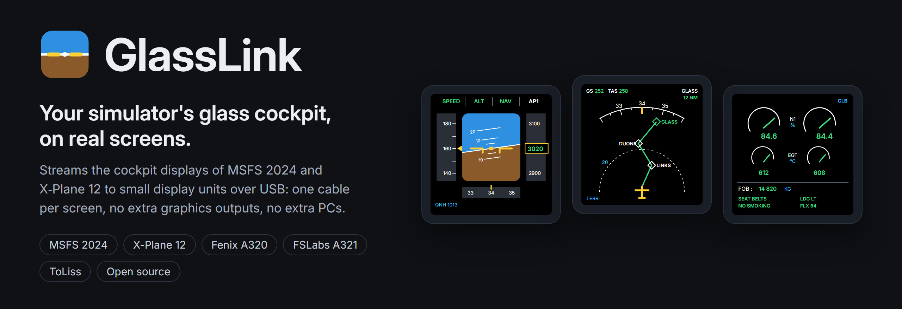
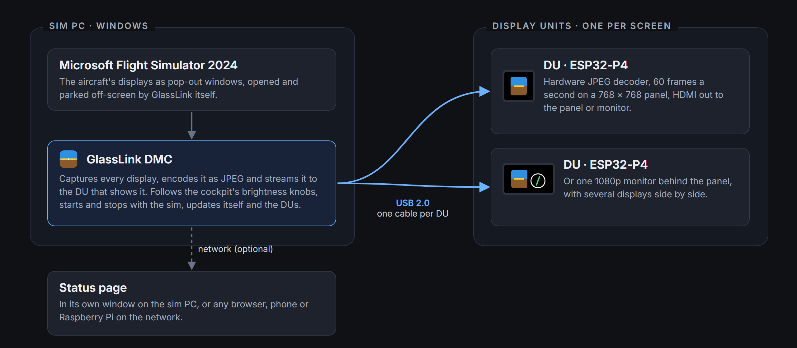
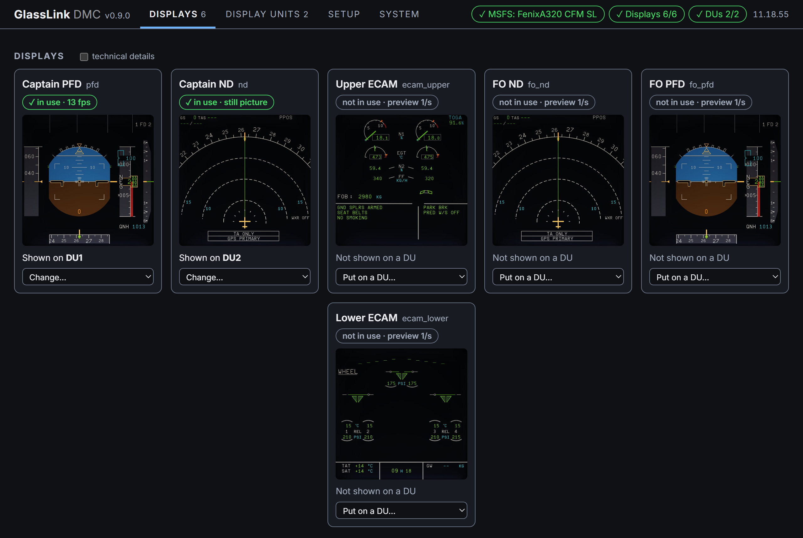
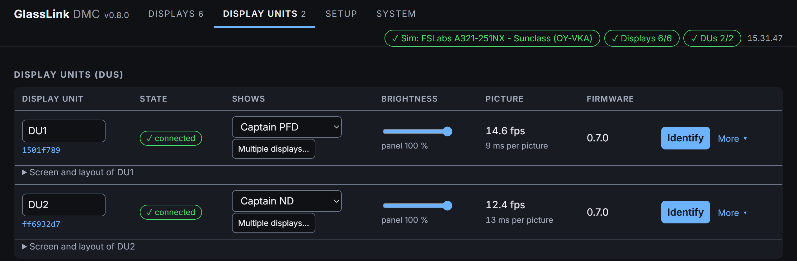
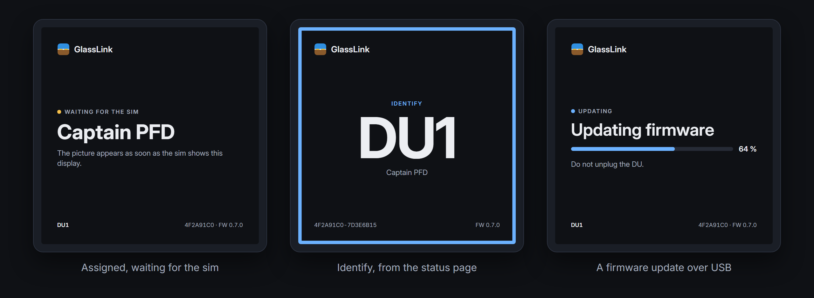
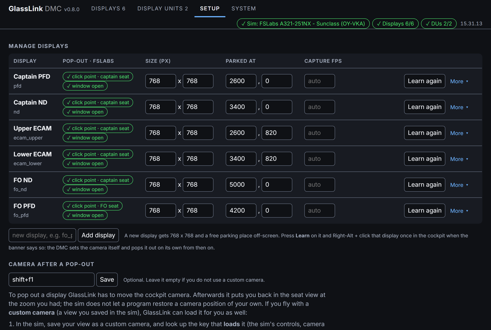
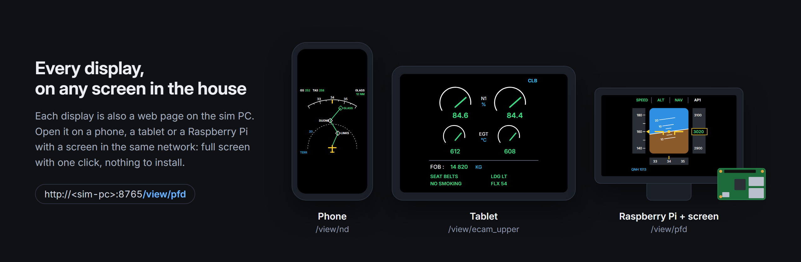

<h1 align="center"></h1>

GlassLink puts a flight simulator's glass-cockpit displays on real screens in a home cockpit. A service on the sim
PC, the **DMC**, captures the aircraft's displays (PFD, ND, ECAM, ...) and streams them over USB to small
**DU** modules, each of which drives a panel or monitor. No GPU ports, no extra PCs, one USB cable per DU. Built for
an Airbus home cockpit on MSFS 2024 with the Fenix A320 and the FSLabs A321, and on X-Plane 12 with the ToLiss A321;
the capture side works with any aircraft, the automatic pop-out needs a profile per aircraft (built in for those,
learned for other MSFS aircraft).

| Term | In the aircraft | Here |
|---|---|---|
| **DMC** | Display Management Computer, feeds the display units | the GlassLink program on the sim PC: `GlassLink.exe`, a tray application (`dotnet/`) |
| **DU** | Display Unit, one screen in the panel | one GlassLink module: ESP32-P4 board + HDMI bridge + panel or monitor (`firmware/`) |

Why pixels: re-rendering a PFD from simulator variables means rewriting the aircraft's display software. Capturing
the rendered pop-out windows gives an exact copy for any aircraft.

## What it does

- **MSFS 2024 and X-Plane 12**: the Fenix A320 and the FSLabs A321 in MSFS, the ToLiss A321 and A339 (and the rest of
  the ToLiss family) in X-Plane, built in. GlassLink sees which sim runs; the displays and the DUs' assignments are
  the same in both, so a DU that shows the captain's PFD shows it in either sim.
- **Pops the displays out by itself**, up to six (captain and first officer side), dark ones too: a cold and dark
  cockpit at the gate pops out like a ready one. In MSFS: camera reset, Right-Alt + click on each display, then your
  own camera view back; a new aircraft needs **Learn** once per display. In X-Plane the ToLiss opens its displays by
  command, so nothing moves at all. Either way the windows are sized to the DU and parked off-screen.
- **Any number of DUs**, each assigned to a display on the status page; a DU is known by its serial number, so any
  unit can take any place in the cockpit.
- **Several displays on one DU**: for a monitor behind a MIP with two cut-outs, place the displays in a layout on the
  status page and line them up with test cards. The DMC sends them as one picture as wide as the screen, which the
  DU draws straight into its frame buffer.
- **HDMI modes** per DU: 768x768 (the square 8.8" panels), 1024x768, 800x600, 1280x720, 1920x1080 at 30 Hz.
- **Updates itself** from GitHub Releases on your click (checked against the release's checksums), and **updates
  the DUs' firmware** over USB from the status page, with rollback if a new image does not come up.
- **Status page** in its own window and on any device in the LAN (read-only from other devices unless allowed),
  with advice when something limits the frame rate. Light and dark mode follow Windows; text follows the system
  text size; no state is shown by colour alone.
- **Any screen in the network can show a display** too: every display is also a web page, for a phone, a tablet or
  a Raspberry Pi with a screen ([below](#viewing-a-display-on-another-device)).
- **The DUs say what is going on** when they have no picture to show: waiting for the PC, waiting for the DMC, not
  assigned, the assigned display waiting for the sim, Identify, a firmware update with its progress.

What a DU achieves (DMC and firmware 0.6.0, PFD-like frames of about 140 KB, measured on a Waveshare
ESP32-P4-NANO):

| Setup | Frames per second |
|---|---|
| 768x768 panel, any brightness | 60 (the panel's refresh; the Fenix draws its displays at about 20, the ToLiss in X-Plane 12 at about 25) |
| 1080p monitor, PFD + ND side by side (two 768x768) | 26-30 for both |
| 1080p monitor, one display as large as 1056x1056 | about 22 |

A DU that shows fewer than 20 frames a second while its displays change faster is reported on the status page with
what helps.

## Requirements

- Windows 10 1903 or later, or Windows 11, and MSFS 2024 (MSFS 2020 is untested) or X-Plane 12.1.4 or later (its
  web API on, which is X-Plane's default).
- Nothing else for a release: it includes Microsoft's `SimConnect.dll` (unmodified, see
  [THIRD-PARTY-NOTICES.md](THIRD-PARTY-NOTICES.md)). A checkout does not: put a copy in `dotnet\lib\` (ignored by
  git) or `%LOCALAPPDATA%\GlassLink\`, or install the MSFS SDK. Without it the DMC still streams, but pops nothing
  out in MSFS and does not follow the Fenix's brightness knobs. X-Plane does not need it.
- Graphics driver: no driver-level frame generation for the sim (AMD Fluid Motion Frames / HYPR-RX, NVIDIA Smooth
  Motion). It leaves pop-out windows with about 13 frames a second. See [Troubleshooting](docs/TROUBLESHOOTING.md).
- DUs: see [Hardware](docs/hardware.md).

## Install and first flight

1. Run `GlassLink-<version>-setup.exe` (from a release, or built with `tools\build-release.ps1`). GlassLink sits in
   the notification area; its menu opens the status page and offers "Start with Windows" and "Start and stop with
   the simulator".
2. Plug in the DUs. A new DU shows NOT ASSIGNED with its serial; on the status page press **Identify** to see which
   one it is and choose its display (Display units tab, or "Put on a DU" on a display's card).
3. Start the sim and load the Fenix or the FSLabs. About ten seconds after you are in the cockpit, GlassLink pops the
   displays out (about 20 s for four, do not touch mouse or keyboard meanwhile) and the DUs show them.
4. For another aircraft: Setup tab, **Learn** on each display, then Right-Alt + click that display once in the sim.
5. X-Plane 12 with the ToLiss, once: in the ToLiss menu (ISCS) switch on "Use popout windows for popups" and "Save
   popup config on quit", then click each display in the cockpit and pop its popup out with the button at the right
   end of its title bar. From then on GlassLink opens them by itself, within a minute of loading a flight.

Stop GlassLink with **Quit** in its tray menu. Never end it with Task Manager while the sim runs: ending a process
that holds window captures can upset the graphics driver.

The configuration is `%LOCALAPPDATA%\GlassLink\config.json` for an installed copy (the repository root's
`config.json` for a checkout); the status page edits everything a user needs. Reference: `config.example.json` and
[Configuration](#configuration).

## Viewing a display on another device

Any browser in the LAN: `http://<sim-pc>:8765/view/pfd` (click for full screen; `?rotate=90`, `?mode=mjpeg`,
`?fps=1` for a frame counter). A phone gets a lighter stream by itself. A Raspberry Pi with a screen can show a display
the same way: [pi/SETUP.md](pi/SETUP.md). Allow the port in the firewall when the installer offers it.

## Configuration

`config.json`, sections (see `config.example.json`):

| Key | Meaning |
|---|---|
| `server.port`, `server.host`, `server.allow_lan_control` | status page port; changes from other devices are refused unless `allow_lan_control` is true |
| `capture.fps`, `quality`, `subsampling` | capture limit (default 40), JPEG quality (85), `420` or `444` |
| `displays.<name>.match` | which window is the display: `process`, `class`, `title` (substring), `title_exact`, `title_regex` |
| `displays.<name>.client_size`, `position` | the size the sim renders the pop-out at (whole 16-pixel blocks) and where it is parked |
| `displays.<name>.max_size`, `fps`, `quality` | per display: a smaller picture, other limits |
| `displays.<name>.crop`, `tool_window` | a frame the window draws around the display, cut off (the window is made that much larger), and keeping the window out of Alt+Tab and the taskbar. The built-in X-Plane profiles set both for their pop-outs themselves |
| `modules.<serial>` | per DU: `display`, `label`, `brightness` (trim), `screen` (HDMI mode 0-4), `tiles` (several displays: `{display: {x, y}}`); `rotation` is stored but not drawn by the DU yet |
| `popout` | `auto`, `aircraft`, `zoom`, `grace_s`, `retry_s`, `camera_restore_key` (e.g. `shift+f1`), `profiles` |
| `brightness` | `enabled`, `source`: the DUs follow the cockpit's display brightness knobs where the pop-outs do not dim themselves (the Fenix, through SimConnect); the FSLabs and the ToLiss dim their own |
| `updates` | `check` (default true): look for a newer GlassLink on GitHub every six hours |

## HTTP API

The status page uses these; they are also handy for scripts. Changes (POST, DELETE) come from this PC only unless
`server.allow_lan_control` is set, and must be JSON.

| Endpoint | |
|---|---|
| `GET /status` | everything the status page shows (displays, DUs, sim, advice) |
| `GET /view/<name>`, `/ws/<name>`, `/stream/<name>`, `/snapshot/<name>.jpg` | viewer page, WebSocket stream (latest frame only, client-paced), MJPEG, last frame |
| `GET/POST /displays`, `POST/DELETE /displays/<name>`, `POST /displays/<name>/learn`, `/close` | display editor, Learn, close a pop-out |
| `GET /modules`, `POST/DELETE /modules/<serial>` | DUs: display, label, brightness, screen, tiles, cards, `command` (`ident`, `ping`, `update`) |
| `GET/POST /popout/settings`, `POST /popouts/close-strays`, `POST /learn/cancel` | pop-out settings |
| `POST /update/check`, `/update/install`, `/update/settings` | look for a newer GlassLink now, install it, switch the automatic check on or off |
| `POST /shutdown` | stop the DMC (what `GlassLink.exe --quit` does) |

## Repository

| Folder | |
|---|---|
| `dotnet/` | the DMC: `GlassLink.exe` and its libraries, the bench tool, tests ([dotnet/README.md](dotnet/README.md)) |
| `firmware/` | the DU firmware, ESP-IDF 5.5 for the ESP32-P4 ([firmware/README.md](firmware/README.md)) |
| `web/` | the status page and viewer the DMC serves, and their font |
| `tools/` | measuring and test scripts (Python): `sim_fps.py`, `content_fps.py`, `du_multi_test.py`, `du_cycle_test.py`, `load_test.py`, `test_pattern.py`, `measure_latency.py`, `stop_server.py`; `xplane-turn.ps1` (turns the aircraft in X-Plane for a frame-rate test); `build-release.ps1`; `render-images.ps1` (this page's drawn pictures, from `docs/images/src/`; the `status-*.png` ones are screenshots) |
| `installer/` | Inno Setup script |
| `pi/` | the network viewer for a Raspberry Pi |
| `docs/` | [USB protocol](docs/usb-protocol.md), [hardware](docs/hardware.md), [troubleshooting](docs/TROUBLESHOOTING.md), [design notes and findings](docs/notes.md), [panel data](docs/panel-DBC088HXN60L050A.md) |

Building: `start-server.bat` builds and starts the DMC from a checkout (needs the .NET 10 SDK); the Python tools
need Python 3.10+ and `pip install -r requirements.txt` in a venv. Every push is built and tested on GitHub
(`.github/workflows/ci.yml`: .NET build and tests, Python compile, firmware build). Changes are listed in
[CHANGELOG.md](CHANGELOG.md); open work is in the GitHub issues. How to contribute: [CONTRIBUTING.md](CONTRIBUTING.md);
security reports: [SECURITY.md](SECURITY.md); how a release is made: [docs/releasing.md](docs/releasing.md).

## Licence

Copyright (C) 2026 Thomas Marcussen.

GlassLink is free software: you can redistribute it and/or modify it under the terms of the **GNU General Public
License version 3**, or (at your option) any later version ([LICENSE](LICENSE)). In short: use it, change it, build
products with it, sell them; but whoever passes GlassLink or a modified version on must pass on its source code under
the same licence, so improvements come back to everyone. It comes without any warranty.

Additional permission under GNU GPL version 3 section 7: if you modify this program, or any covered work, by linking
or combining it with Microsoft's SimConnect client library (`SimConnect.dll` from the Microsoft Flight Simulator
SDK), the Microsoft Edge WebView2 Runtime or the Microsoft Visual C++ runtime (or modified versions of those
libraries), containing parts covered by the terms of their licences, the licensors of this program grant you
additional permission to convey the resulting work.

Board designs, once published here, will be under the CERN Open Hardware Licence version 2, strongly reciprocal
(CERN-OHL-S-2.0). Components of others and their licences: [THIRD-PARTY-NOTICES.md](THIRD-PARTY-NOTICES.md).
GlassLink is not affiliated with or endorsed by Microsoft, Asobo, Fenix Simulations or Flight Sim Labs.
